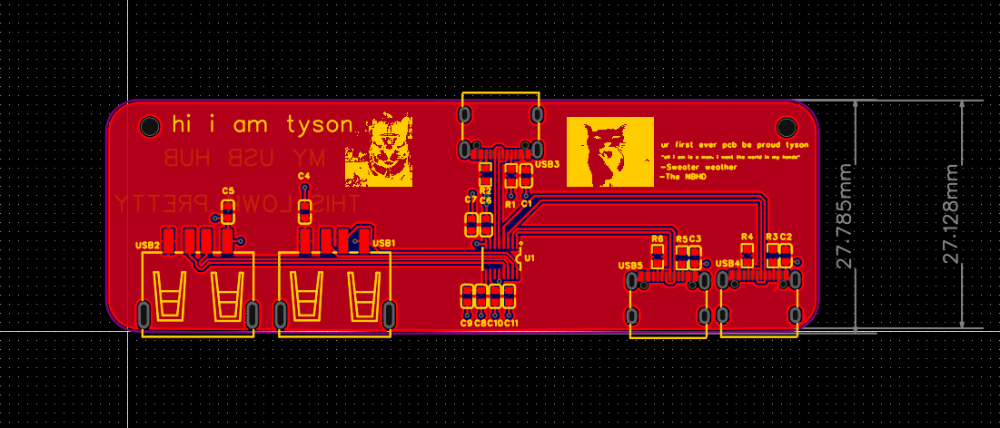

# tysons-usb-hub
myyy cool usb hub
it has 2 usb a ports
and 2 usb c ports
with magnets to attach to under my desk

the pcb 

case desgin 

BOM
[BOM](../../../Downloads/BOM_Board1_PCB1_2026-04-27.xlsx)

fetures 

2 usb a ports
2 usb c ports
it attaches udner my desk
cool hexagon desgin

