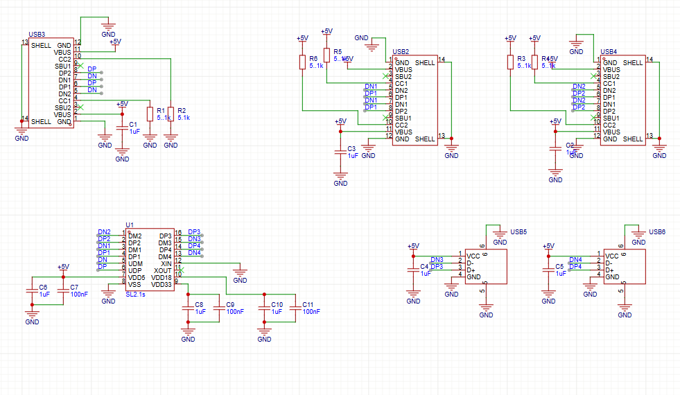
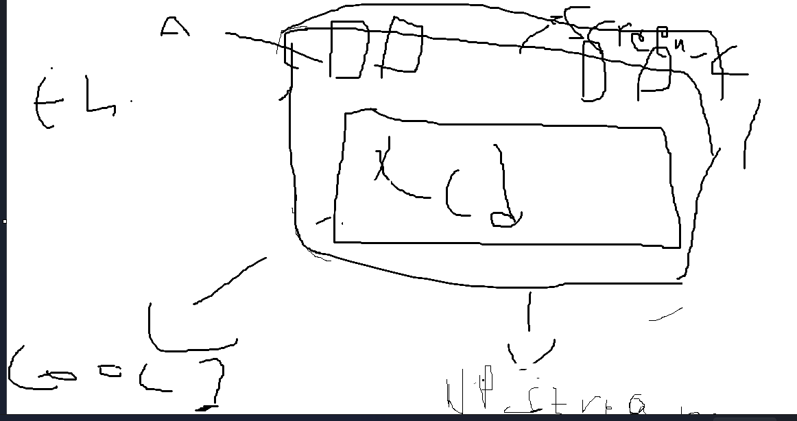
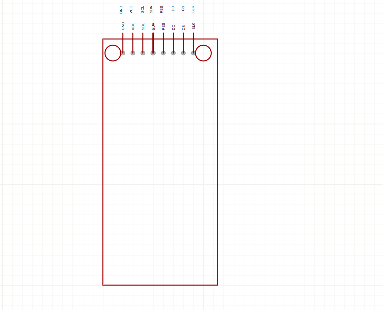
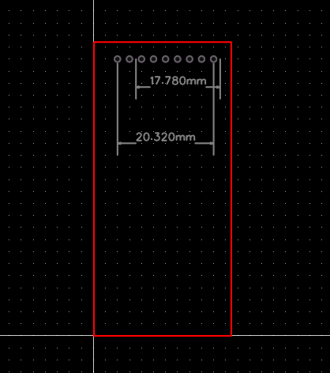
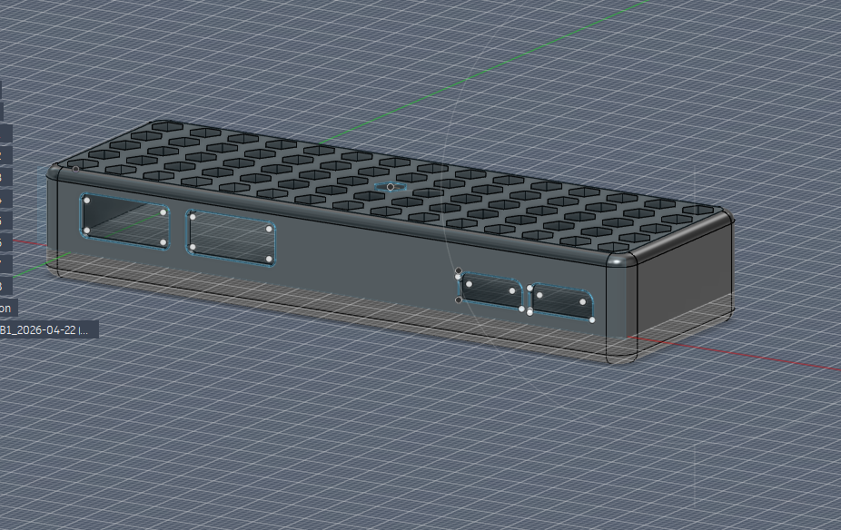

title	tysons usb hub
author	Tyson
description	just a good usb hub to attach under my desk
created_at	2026-06-11
total = 6.9 hours hehehe

Day 1 - 2026-04-11 8:00 PM - the schematics

45min tracked

MY FIRST EVER JOURNAL FOR HORIZON
soooooo this was quite hard and tbh i am all for it
this is not tracked but i first started by reading the whole docs skimming through the guided projects then i really wanted to make a macro pad but it was hard i really didint know how to the guided projects of blue print arent clear soo i decided to make a usb hub now this is going to be for learning i dont really need it tbh butt its okay we gonna do it i was gonna download kicad but it just would not download soo i chose easyeda and then i started following the tutroial to be completely honest i didn't understand a single thing dude (insert sob emoji ) but what i can doo i finished the schematics and then i will go watch yt tutorial on what ts is whats all of this what different pins mean and how to find parts and shit thxx for reading

here is my schematics i tried organizing every thing and make it look pretty and i tried my best and it honestly looks soo good

Day 2 2026-04-11 11:52 PM - the forbiden lcd 

1h 36m tracked

OMG THIS IS THE WORST THING I HAVE EVER TRIED TO DO IN MY LIFE
SO FIRST OF ALL
i was going to start designing the pcb then i went to ms paint and made a simple sketch

ik ik it looks horrible but basically on the left is my usb a
and on the right is the usb c and on the bottom is the usb for the down stream
its such a piece of art and i figured why not add an lcd to it for a bit of personality but boi was i wrong i first strated be looking for the best screen size and the cheapest some slackers said 4 inches is too big ( personally i think so hehehe) 0so i decided to go with a 2 inch for 5 bucks which is awesome but the problem is i started searching for the lcd and here when it all went down hill when i finally saw something i like it i though tot myself ohh i could just add thats to easyeda but i was wrong tmy lcd was not there i kept searching trying diffrent ones everything and anything but i just could not then i asked slack for help and they said to add ur own foot print so i tried doing that but for some reason the lcd had no data sheet just an aliexpress image and that image was so bad and wrong i first thought the pitch was 1.5 but it was not then i tried 2.54 it was still not it was very misaligned cus of the aliexpress drawing and then i fucking realized that i drew the symbol wrong (insert sob emoji) so i had to re do it and start over for some reason the pitch just wasnt right untill i figured it outttt it was the fucking image it has 9 pins all thought it says 8x2.54 such a fucking liar aliexpress i hate you and the drawing looks so wrong but i am at least happy with it i might edit later and here is how it looks

this the symbol and here is the pcb

Day 3- the pcb 2026-04-12

1h 59m tracked

ALR ALR ALRRR WE DONE SOME THINGSSS
sooo first of all i wanna say look at this pretty baby
im jus so proud

but for all honesty this like nothing for most hack clubber here its easy game butt for me im genuinely happy with this and with time i will only get better butt i first started by ditching the lcd ik ik booo i spend a hour and half trying to figure it out but it is what it is
the reason i did that was i just didn't want any issues with the board since its my first time and i have no experience at all soo i will shine in the cad work cus ik how to cad but the board its pretty basic then i started by making the pcb outline ik its a boring square but i love this square i rounded the corner cus i read thats good in docs then i started with this most painful thing of my life duse routing isss s fucking hard like all of these lines all of these r just so confusing and stuff but i kept playing with them editing them orientating them in different places and i was indecisive i could not figure anything out but finally i did it then ii routed the dp and dn which was okay then i started by making the vias anddd its looking so good rn i added m.2 holes for mounting later and i will go ahead and add a silk screen 

day 4- the case 2026-04-22

1h 19m tracked

alrr so i did a lot of things i finally started with cad which is i kind of know some of cad and i started by getting the 3d fiel of the pcb so i can design around it in cad but for some reason it just didn't want to upload but i finally got it to in fusion but then the usb c didn't upload so i tried seeing why and it just didn't tell me in easyeda it was like this "ur usb..." but i could not liek see the rest of the text if yk what i mean there is nothing i can do about it so i just tried to eyeball it anyways i started by making a simple box then i cut the holes of the usb a and usb c same with the downstream and i filleted those around kept playing with it until i saw something i like but when i filleted the box it self it was cutting in to the pcb so i had to re define it to get it working and it finally did work i also then added m.2 holes for mounting i added magnet holes so i can attach them under my desk i made them hidden by just 3 layer and after i did them i realized i didint have any tolerance so i added those i tried doing a pattern at top cus it looked so bland but i failed then i made a hexagons which look cool tbh and thats it i am kinda meh of how it turned out but i will edit it much more

day 5- FINISHED the case 2026-04-27

i did not do alot i jsut made a simple conmnecter then opened it in bambu lab and now its done